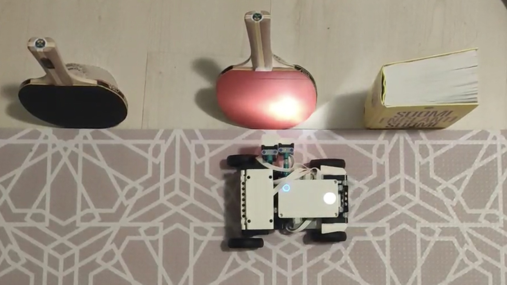

# IoT-project

**Device**: LEGO Mindstorms Robot Inventor

**Platform**: Mindstorms IDE

#### The robot in operation 

The python file realizes the measurements of the color and length of the objects. 

In addition, more functions and features can be implemented to realize an inventory management system.
